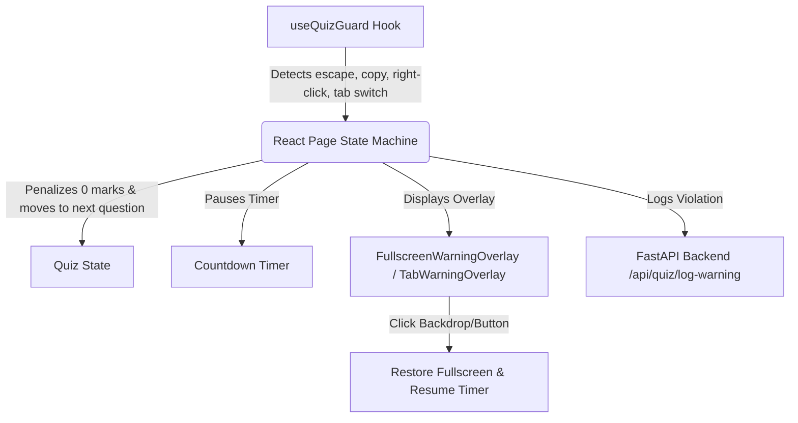

# Quiz Anti-Cheating Implementation Guide

This guide details the architecture, source code, and key browser security workarounds used to build the robust online quiz anti-cheating mechanism. You can use this blueprint to implement the same features in other React/Next.js and Python backend applications.

---

## 1. Core Architecture Overview

The anti-cheating system consists of a frontend state machine, a custom React event listener hook, specialized blocking overlays, and a FastAPI logging backend:



---

## 2. The Event Listener Hook: `useQuizGuard.ts`

This hook encapsulates all browser event listeners. It handles clipboard operations, keyboard shortcuts, right-clicks, tab visibility changes, and fullscreen state transitions.

### Key Browser Gesture Workaround:
Modern browsers block programmatic `requestFullscreen()` unless triggered by a **user gesture** (like a click or keypress). To bypass this and force the user back into fullscreen:
* We trap the **`keyup`** event (specifically checking for the `Escape` key release).
* We bind a global **`click`** listener to the document while the quiz is active.
* The moment the user interacts with the page (releasing `Escape` or clicking anywhere), the browser treats it as an active gesture and instantly forces the window back into fullscreen mode.

### Source Code: `useQuizGuard.ts`

```typescript
"use client";

import { useEffect } from "react";

interface UseQuizGuardOptions {
  enabled: boolean;
  onFullscreenExit: (message: string) => void;
  onFullscreenEnter: () => void;
  onTabSwitch: (message: string) => void;
  onToastWarning: (message: string) => void;
}

export function useQuizGuard({
  enabled,
  onFullscreenExit,
  onFullscreenEnter,
  onTabSwitch,
  onToastWarning,
}: UseQuizGuardOptions) {
  useEffect(() => {
    if (!enabled) {
      return;
    }

    // Programmatically request fullscreen
    const attemptFullscreen = () => {
      if (document.fullscreenElement) {
        return;
      }
      void document.documentElement.requestFullscreen()
        .then(() => {
          onFullscreenEnter();
        })
        .catch(() => {
          // If programmatic attempt fails, notify parent to display warning overlay
          onFullscreenExit("You exited fullscreen! You have been awarded 0 marks for this question and moved to the next question.");
        });
    };

    const onFullscreenChange = () => {
      if (!document.fullscreenElement) {
        attemptFullscreen();
        onFullscreenExit("You exited fullscreen! You have been awarded 0 marks for this question and moved to the next question.");
      } else {
        onFullscreenEnter();
      }
    };

    const onVisibilityChange = () => {
      if (document.hidden) {
        onTabSwitch("You must stay on this page during the quiz. This incident has been logged.");
      }
    };

    const onCopy = (event: ClipboardEvent) => {
      event.preventDefault();
      onToastWarning("Copying is disabled during the quiz.");
    };

    const onPaste = (event: ClipboardEvent) => {
      event.preventDefault();
      onToastWarning("Pasting is disabled during the quiz.");
    };

    const onCut = (event: ClipboardEvent) => {
      event.preventDefault();
      onToastWarning("Cutting text is disabled during the quiz.");
    };

    const onContextMenu = (event: MouseEvent) => {
      event.preventDefault();
      onToastWarning("Right-click is disabled during the quiz.");
    };

    const onKeyDown = (event: KeyboardEvent) => {
      const key = event.key.toLowerCase();
      const hasModifier = event.ctrlKey || event.metaKey;

      if (key === "escape") {
        event.preventDefault();
        attemptFullscreen();
        return;
      }

      // Block Ctrl+C, Ctrl+V, Ctrl+X, Ctrl+A
      if (hasModifier && ["c", "v", "x", "a"].includes(key)) {
        event.preventDefault();
        onToastWarning(`Keyboard shortcut (Ctrl + ${key.toUpperCase()}) is disabled during the quiz.`);
        return;
      }

      if (!document.fullscreenElement) {
        attemptFullscreen();
      }
    };

    const onKeyUp = (event: KeyboardEvent) => {
      if (event.key === "Escape" || event.key === "Esc") {
        attemptFullscreen();
      }
    };

    const onGlobalClick = () => {
      attemptFullscreen();
    };

    const onSelectStart = (event: Event) => {
      event.preventDefault();
    };

    // Attempt fullscreen on mount
    attemptFullscreen();

    // Bind listeners
    document.addEventListener("fullscreenchange", onFullscreenChange);
    document.addEventListener("visibilitychange", onVisibilityChange);
    document.addEventListener("copy", onCopy);
    document.addEventListener("paste", onPaste);
    document.addEventListener("cut", onCut);
    document.addEventListener("contextmenu", onContextMenu);
    document.addEventListener("keydown", onKeyDown);
    document.addEventListener("keyup", onKeyUp);
    document.addEventListener("click", onGlobalClick);
    document.addEventListener("selectstart", onSelectStart);

    return () => {
      // Clean up listeners
      document.removeEventListener("fullscreenchange", onFullscreenChange);
      document.removeEventListener("visibilitychange", onVisibilityChange);
      document.removeEventListener("copy", onCopy);
      document.removeEventListener("paste", onPaste);
      document.removeEventListener("cut", onCut);
      document.removeEventListener("contextmenu", onContextMenu);
      document.removeEventListener("keydown", onKeyDown);
      document.removeEventListener("keyup", onKeyUp);
      document.removeEventListener("click", onGlobalClick);
      document.removeEventListener("selectstart", onSelectStart);
    };
  }, [enabled, onFullscreenExit, onFullscreenEnter, onTabSwitch, onToastWarning]);
}
```

---

## 3. The State Machine & Penalty Logic: `page.tsx`

The core component manages state synchronization, timer controls, penalization, and overlay rendering.

### Key Logic Checklist:
1. **Self-Healing Timer**: Uses a `lastQuestionIndexRef` to distinguish between a **question transition** (resets timer to 25s) and a **tab warning resume** (resumes timer from the paused value).
2. **Double-Penalty Prevention**: Checks `submissionLockRef.current` in the exit callback to ensure a user is not penalized twice if an exit happens concurrently with a click or time-out.
3. **Timer Pause**: If `isFullscreen` becomes `false`, the countdown `setInterval` is immediately cleared and does not start.

### Source Code Snippet: `page.tsx`

```typescript
export default function QuizPage() {
  const [quizState, dispatch] = useReducer(quizReducer, undefined, createInitialState);
  const [remainingSeconds, setRemainingSeconds] = useState(QUIZ_TIME_LIMIT_SECONDS);
  const submissionLockRef = useRef(false);
  const timeoutHandledRef = useRef(false);
  const questionEndAtRef = useRef(Date.now() + QUIZ_TIME_LIMIT_SECONDS * 1000);
  const lastQuestionIndexRef = useRef(quizState.currentQuestionIndex);

  // Anti-cheat states
  const [isFullscreen, setIsFullscreen] = useState(true);
  const [fullscreenWarningCount, setFullscreenWarningCount] = useState(0);
  const [fullscreenMessage, setFullscreenMessage] = useState<string | null>(null);

  const [tabWarningVisible, setTabWarningVisible] = useState(false);
  const [tabWarningCount, setTabWarningCount] = useState(0);
  const [tabMessage, setTabMessage] = useState<string | null>(null);
  const [toastWarning, setToastWarning] = useState<string | null>(null);

  // Self-healing timer effect
  useEffect(() => {
    submissionLockRef.current = false;
    timeoutHandledRef.current = false;

    // Pause timer if user exits fullscreen or switches tab
    if (quizState.completed || !isFullscreen || tabWarningVisible) {
      return;
    }

    // Reset timer on question change; otherwise, resume from remaining
    if (lastQuestionIndexRef.current !== quizState.currentQuestionIndex) {
      setRemainingSeconds(QUIZ_TIME_LIMIT_SECONDS);
      questionEndAtRef.current = Date.now() + QUIZ_TIME_LIMIT_SECONDS * 1000;
      lastQuestionIndexRef.current = quizState.currentQuestionIndex;
    } else {
      questionEndAtRef.current = Date.now() + remainingSeconds * 1000;
    }

    const intervalId = window.setInterval(() => {
      const nextRemainingSeconds = Math.max(0, Math.ceil((questionEndAtRef.current - Date.now()) / 1000));
      setRemainingSeconds(nextRemainingSeconds);

      if (nextRemainingSeconds === 0 && !timeoutHandledRef.current) {
        timeoutHandledRef.current = true;
        if (!submissionLockRef.current) {
          submissionLockRef.current = true;
          dispatch({ type: "answer", answerIndex: null });
        }
      }
    }, 250);

    return () => {
      window.clearInterval(intervalId);
    };
  }, [quizState.completed, quizState.currentQuestionIndex, isFullscreen, tabWarningVisible]);

  // Hook wiring with 0-marks penalty
  useQuizGuard({
    enabled: !quizState.completed,
    onFullscreenExit: (message) => {
      setIsFullscreen(false);
      setFullscreenWarningCount((prev) => prev + 1);
      setFullscreenMessage(message);

      if (quizState.completed || submissionLockRef.current) {
        return;
      }
      // Penalize: set lock, log to backend, and award 0 marks (null answer) to move next
      submissionLockRef.current = true;
      void logWarningToBackend("fullscreen", "fullscreen-exit", message);
      dispatch({ type: "answer", answerIndex: null });
    },
    onFullscreenEnter: () => {
      setIsFullscreen(true);
    },
    onTabSwitch: (message) => {
      setTabWarningVisible(true);
      setTabWarningCount((prev) => {
        const next = prev + 1;
        void logWarningToBackend("fullscreen", "tab-switch", message);
        return next;
      });
      setTabMessage(message);
    },
    onToastWarning: (msg) => setToastWarning(msg),
  });

  // Resume Fullscreen handler
  const handleResumeFullscreen = () => {
    void document.documentElement.requestFullscreen()
      .then(() => setIsFullscreen(true))
      .catch(() => setIsFullscreen(false));
  };

  return (
    <>
      <FullscreenWarningOverlay
        visible={!quizState.completed && !isFullscreen}
        message={fullscreenMessage}
        warningCount={fullscreenWarningCount}
        onResumeFullscreen={handleResumeFullscreen}
      />
      {/* ... Rest of Quiz Rendering ... */}
    </>
  );
}
```

---

## 4. UI Overlay Component: `FullscreenWarningOverlay.tsx`

This component covers the entire viewport, blocking student view/clicks on the quiz questions while displaying the warning and instructions.

### Gesture Optimization:
We set `onClick={onResumeFullscreen}` on the outer wrapper `div className="quiz-overlay"`. Any click backdrop interaction acts as the required user gesture to instantly trigger `requestFullscreen()` and hide the overlay. We use `e.stopPropagation()` on the inner card to avoid accidental clicks from feeling misaligned.

### Source Code: `FullscreenWarningOverlay.tsx`

```typescript
"use client";

interface FullscreenWarningOverlayProps {
  visible: boolean;
  message: string | null;
  warningCount: number;
  onResumeFullscreen: () => void;
}

export function FullscreenWarningOverlay({
  visible,
  message,
  warningCount,
  onResumeFullscreen,
}: FullscreenWarningOverlayProps) {
  if (!visible) {
    return null;
  }

  return (
    <div
      className="quiz-overlay"
      role="dialog"
      aria-modal="true"
      aria-labelledby="fullscreen-warning-title"
      onClick={onResumeFullscreen}
      style={{ cursor: "pointer" }}
    >
      <div className="overlay-card" onClick={(e) => e.stopPropagation()} style={{ cursor: "default" }}>
        <div className="overlay-icon">!</div>
        <div className="overlay-badge">
          Fullscreen warning {warningCount} time{warningCount === 1 ? "" : "s"}
        </div>
        <h2 id="fullscreen-warning-title">You must stay in fullscreen to continue the quiz</h2>
        <p>{message ?? "You must stay in fullscreen to continue the quiz."}</p>
        <button type="button" className="button button-primary" onClick={onResumeFullscreen}>
          Resume Fullscreen
        </button>
      </div>
    </div>
  );
}
```

### Supporting CSS Styles (Vanilla CSS)
Add this to your stylesheet (e.g. `globals.css`) for smooth overlays:

```css
.quiz-overlay {
  position: fixed;
  top: 0;
  left: 0;
  right: 0;
  bottom: 0;
  background-color: rgba(15, 23, 42, 0.85);
  backdrop-filter: blur(8px);
  display: flex;
  align-items: center;
  justify-content: center;
  z-index: 9999;
  padding: 1.5rem;
}

.overlay-card {
  background-color: #1e293b;
  border: 1px solid #334155;
  border-radius: 1rem;
  max-width: 28rem;
  width: 100%;
  padding: 2rem;
  text-align: center;
  box-shadow: 0 25px 50px -12px rgba(0, 0, 0, 0.5);
}

.overlay-icon {
  width: 3.5rem;
  height: 3.5rem;
  background-color: #ef4444;
  color: white;
  border-radius: 50%;
  display: flex;
  align-items: center;
  justify-content: center;
  font-size: 1.75rem;
  font-weight: bold;
  margin: 0 auto 1rem auto;
}

.overlay-badge {
  background-color: rgba(239, 68, 68, 0.2);
  color: #f87171;
  padding: 0.25rem 0.75rem;
  border-radius: 9999px;
  font-size: 0.875rem;
  display: inline-block;
  margin-bottom: 1rem;
}
```

---

## 5. Backend Server Configuration

For anti-cheating events to be logged, the backend must support CORS requests originating from the frontend (e.g. when running on alternative development ports like `http://localhost:3001`).

### CORS Configuration & Log Endpoint in FastAPI:

```python
from fastapi import FastAPI
from fastapi.middleware.cors import CORSMiddleware
from pydantic import BaseModel
from datetime import datetime

app = FastAPI()

# Allow multiple frontend origins
app.add_middleware(
    CORSMiddleware,
    allow_origins=[
        "http://localhost:3000",
        "http://127.0.0.1:3000",
        "http://localhost:3001",
        "http://127.0.0.1:3001",
        "http://localhost:3002",
        "http://127.0.0.1:3002",
    ],
    allow_credentials=True,
    allow_methods=["*"],
    allow_headers=["*"],
)

class WarningLog(BaseModel):
    type: str
    code: str
    message: str
    timestamp: datetime

@app.post("/api/quiz/log-warning")
async def log_warning(log: WarningLog):
    # Process or store the cheating incident log here (e.g., database insert)
    print(f"[{log.timestamp}] [WARNING] Type: {log.type}, Code: {log.code}, Message: {log.message}")
    return {"status": "success", "recorded": True}
```

---

## 6. Implementation Checklist for Your New Project:

- [ ] **Step 1**: Copy `useQuizGuard.ts` into your hooks folder.
- [ ] **Step 2**: Create the `FullscreenWarningOverlay.tsx` component and add the styling rules.
- [ ] **Step 3**: Wire the hook to your main quiz component, passing options for tab visibility warnings and clipboard warnings.
- [ ] **Step 4**: Implement the state transitions in your page controller:
  * Award **0 marks** (or `null`) for the active question on exit.
  * Pause the timer state if `isFullscreen` is false.
  * Increment the question index state.
- [ ] **Step 5**: Update the backend CORS configuration to support the port your frontend is running on.
